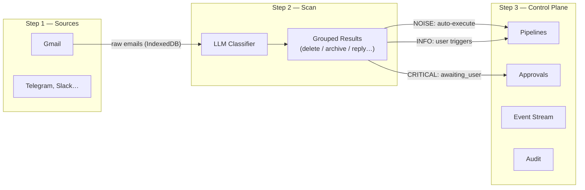

# me-ai — Architecture

**Browser-only AI assistant built on an event-stream model.** 
No backend server. The LLM runs entirely in the browser via WebGPU or Ollama, and Gmail uses client-side OAuth.

## Three-Step User Flow

The app is structured around three explicit steps that the user progresses through in order:



| Step | Route | Purpose |
|------|-------|---------|
| **Sources** | `#sources` | Connect accounts (Gmail, future: Telegram…), browse raw data |
| **Scan** | `#scan` | Run the LLM classifier over synced emails; review grouped results |
| **Control Plane** | `#pipelines`, `#approvals`, `#stream`, `#audit` | Configure rules/pipelines, review approvals, audit trail |

Scan is the bridge between Sources and the Control Plane — it transforms raw data into typed events that the pipeline system can act on.

## Core Concept: Dynamically Generated Action Flow (n8n-like Architecture)

**This is the most important architectural principle — the foundation of the entire system.**

The system is modeled as a **dynamically generated flow of actions**, conceptually similar to tools like **n8n.io**. 
Rather than having a fixed, hardcoded set of rules, the LLM analyzes incoming data and dynamically structures the execution pipelines.

### 1. Extraction (The "Trigger" Phase)
An **event** is any discrete piece of data that enters the system (e.g., an email message arriving via Gmail sync).
When an event arrives, the LLM dynamically extracts:
- `type` — the event type label (e.g. `"REPLY"`, `"DELETE"`, `"TRACK_DELIVERY"`, `"PAY_BILL"`)
- `group` — the execution policy tier (`NOISE`, `INFO`, `CRITICAL`)
- `suggestedActions` — a dynamically generated list of steps to handle this event

### Plugin Architecture

Plugins provide functionality to work with external services - call external APIs directly (gmail, twitter, and so on).

```
src/lib/plugins/
  base-plugin.js       — BasePlugin class: registerHandler, execute, canExecute
                         Typedefs: PluginContext, PluginResult, ActionHandler
  gmail-plugin.js      — Extends BasePlugin; registers 12 Gmail action handlers
                         Exports: gmailPlugin (singleton), GMAIL_LABELS
  plugin-registry.js   — PluginRegistry singleton: resolves plugin by source, routes execution
                         Exports: pluginRegistry
  execution-service.js — High-level API consumed by UI components
                         Exports: executePipeline, executePipelineBatch, getAvailableActions,
                                  isAuthenticated, getRequiredScopes, EVENT_GROUPS
```

### Chat as Control Interface
The **chat is the control interface** on top of the event stream. Chat messages can be:

1. **Flat/regular** — plain text string (e.g. user questions, LLM text replies)
2. **Typed** — structured message containing:
   - An **event** (or list of events grouped by event type)
   - A **pipeline** of actions associated with the event type
   - Visual components rendered inline in the chat (approval cards for CRITICAL)

**Invisible LLM Interceptors (Control Tags):**
The LLM can trigger actions in the UI by appending hidden text tags to its responses:
- `[EXECUTE:GROUP:{EventType}]` — The UI strips this tag and automatically executes the pipeline batch for the specified pending event type.
- `[SHOW:DASHBOARD]` — The UI strips this tag and automatically renders the interactive `events-grouped` visual dashboard inline within the chat.

CRITICAL event types show an amber **approval card** in the chat instead of a direct execute button. 
The card displays all pipeline steps before execution.

### Data Flow

```
Data Sources (Gmail, future: Telegram, etc.)
    ↓
LLM Triage (triage.js)
    ↓
Event Type → Pipeline
    ↓
Chat Messages (flat text + typed event/command cards)
    ↓
User interaction:
  NOISE    → execute automatically
  INFO     → user clicks Execute
  CRITICAL → user clicks Review → approval card → user confirms → execute
```
