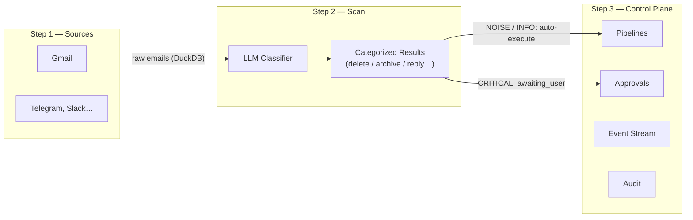
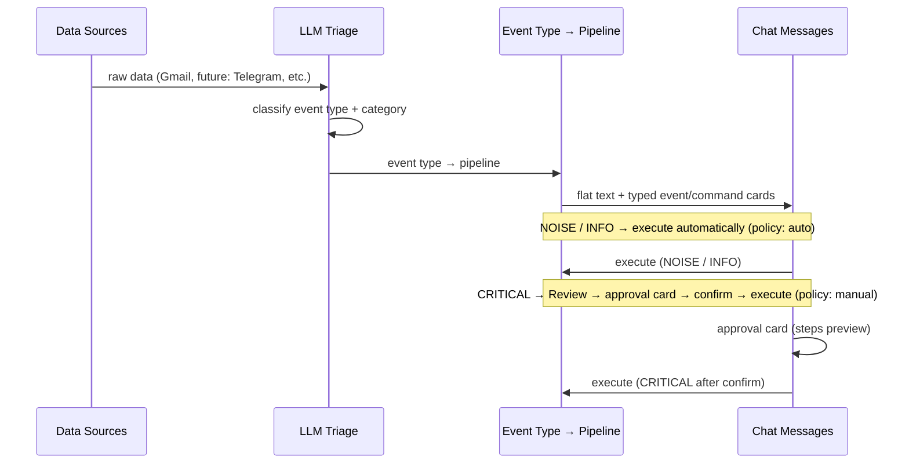

# me-ai — Architecture

**Browser-only AI assistant built on an event-stream model.** 
No backend server. The LLM runs entirely in the browser via WebGPU or Ollama, and Gmail uses client-side OAuth.

## Project layout: core + web

The repo is split into two main parts:

- **me-ai-core** (Rust, WASM) — Business logic and type-safe SQL. All SQL is built in Rust with sea-query; the JS adapter only runs the prepared (sql, params). No SQL lives in app TypeScript for migrated paths. Exposes WASM API via `init(adapter)`, `getEventTypes`, `getSources`, etc. See `me-ai-core/REFERENCE.md` for patterns aligned with meta-secret-core.
- **me-ai-web** (Svelte + TypeScript) — Frontend and app layer. Depends on `me-ai-core` as a local package (file link to `me-ai-core/pkg` after building with wasm-pack).

**Building the project** uses [Task](https://taskfile.dev) (Taskfile in repo root). Do not run `npm install` or `npm run build` from the repo root; use `task` so core is built first and linked correctly.

## Building with Taskfile

All build, test, and deploy steps are defined in `Taskfile.yml` at the repo root. Use `task --list` to see available tasks.

- `task build:core` — Build me-ai-core with wasm-pack (output: `me-ai-core/pkg`). Requires Rust + wasm32 target + wasm-pack.
- `task install` — Build core, then `npm install` in me-ai-web (so `node_modules/me-ai-core` is the built pkg). **Run this first** before building the full app.
- `task build` — Full product build: install (core + npm deps) then `npm run build` in me-ai-web.
- `task build:web` — Build only me-ai-web (skip core). Use when core is already built or you are not touching Rust.
- `task test` — Run unit tests (Vitest, `npm run test:ci`) in me-ai-web.
- `task test:e2e` — Run E2E tests (Playwright); installs Chromium if needed.
- `task check` — Run Svelte/TypeScript check in me-ai-web.
- `task ci` — Full CI: install → unit tests → E2E tests. Same as GitHub Actions.
- `task deploy-build` — Install then full build (for deploy/preview).

**Typical local workflow:**

```bash
task install    # once: build core + npm install
task build      # build full app (or task build:web if core unchanged)
task test       # unit tests
task test:e2e   # E2E (optional)
```

Requires: [Task](https://taskfile.dev/installation/) v3, Node 20, Rust (stable + `wasm32-unknown-unknown`), wasm-pack (for `build:core`).

## Three-Step User Flow

The app is structured around three explicit steps that the user progresses through in order:


```mermaid
flowchart LR
    subgraph step1 [Step 1 — Sources]
        Gmail
        Future["Telegram, Slack…"]
    end
    subgraph step2 [Step 2 — Scan]
        LLM["LLM Classifier"]
        Results["Categorized Results\n(delete / archive / reply…)"]
    end
    subgraph step3 [Step 3 — Control Plane]
        Pipelines
        Approvals
        EventStream["Event Stream"]
        Audit
    end

    Gmail -->|"raw emails (DuckDB)"| LLM
    LLM --> Results
    Results -->|"NOISE / INFO: auto-execute"| Pipelines
    Results -->|"CRITICAL: awaiting_user"| Approvals
```

- **Sources** — route `#sources`: connect accounts (Gmail, future: Telegram…), browse raw data
- **Scan** — route `#scan`: run the LLM classifier over synced emails; review categorized results
- **Control Plane** — routes `#pipelines`, `#approvals`, `#stream`, `#audit`: configure rules/pipelines, review approvals, audit trail

Scan is the bridge between Sources and the Control Plane — it transforms raw data into typed events that the pipeline system can act on.

## Core Concept: Dynamically Generated Action Flow (n8n-like Architecture)

**This is the most important architectural principle — the foundation of the entire system.**

The system is modeled as a **dynamically generated flow of actions**, conceptually similar to tools like **n8n.io**. 
Rather than having a fixed, hardcoded set of rules, the LLM analyzes incoming data and dynamically structures the execution pipelines.

### 1. Extraction (The "Trigger" Phase)
An **event** is any discrete piece of data that enters the system (e.g., an email message arriving via Gmail sync).
When an event arrives, the LLM dynamically extracts:
- `type` — the event type label (e.g. `"REPLY"`, `"DELETE"`, `"TRACK_DELIVERY"`, `"PAY_BILL"`)
- `category` — the execution policy tier (`NOISE`, `INFO`, `CRITICAL`). Only two execution modes: **auto** (NOISE + INFO) and **manual** (CRITICAL).

Pipelines are **not** suggested by the LLM; they come from category defaults and optional per-type overrides (see n8n-architecture). The `suggestedActions` field is no longer produced (kept as an empty array for API compatibility).

### Plugin Architecture

Plugins provide functionality to work with external services - call external APIs directly (gmail, twitter, and so on).

```
src/lib/plugins/
  base-plugin.js       — BasePlugin class: registerHandler, execute, canExecute
                         Typedefs: PluginContext, PluginResult, ActionHandler
  gmail-plugin.js      — Extends BasePlugin; registers 12 Gmail action handlers
                         Exports: gmailPlugin (singleton), GMAIL_LABELS
  plugin-registry.js   — PluginRegistry singleton: resolves plugin by source, routes execution
                         Exports: pluginRegistry
  execution-service.js — High-level API consumed by UI components
                         Exports: executePipeline, executePipelineBatch, getAvailableActions,
                                  isAuthenticated, getRequiredScopes, EVENT_CATEGORY_TIERS (event categories: NOISE/INFO/CRITICAL)
```

### Chat as Control Interface
The **chat is the control interface** on top of the event stream. Chat messages can be:

1. **Flat/regular** — plain text string (e.g. user questions, LLM text replies)
2. **Typed** — structured message containing:
   - An **event** (or list of events grouped by event type / category)
   - A **pipeline** of actions associated with the event type
   - Visual components rendered inline in the chat (approval cards for CRITICAL)

**Invisible LLM Interceptors (Control Tags):**
The LLM can trigger actions in the UI by appending hidden text tags to its responses:
- `[EXECUTE:CATEGORY:{EventType}]` — The UI strips this tag and automatically executes the pipeline batch for the specified pending event category/type.
- `[SHOW:DASHBOARD]` — The UI strips this tag and automatically renders the interactive `events-by-category` visual dashboard inline within the chat.

CRITICAL event types show an amber **approval card** in the chat instead of a direct execute button. 
The card displays all pipeline steps before execution.

### Data Flow


```mermaid
sequenceDiagram
    participant Sources as Data Sources
    participant Triage as LLM Triage
    participant Pipeline as Event Type → Pipeline
    participant Chat as Chat Messages

    Sources->>Triage: raw data (Gmail, future: Telegram, etc.)
    Triage->>Triage: classify event type + category
    Triage->>Pipeline: event type → pipeline
    Pipeline->>Chat: flat text + typed event/command cards

    Note over Chat,Pipeline: NOISE / INFO → execute automatically (policy: auto)
    Chat->>Pipeline: execute (NOISE / INFO)

    Note over Chat,Pipeline: CRITICAL → Review → approval card → confirm → execute (policy: manual)
    Chat->>Chat: approval card (steps preview)
    Chat->>Pipeline: execute (CRITICAL after confirm)
```
